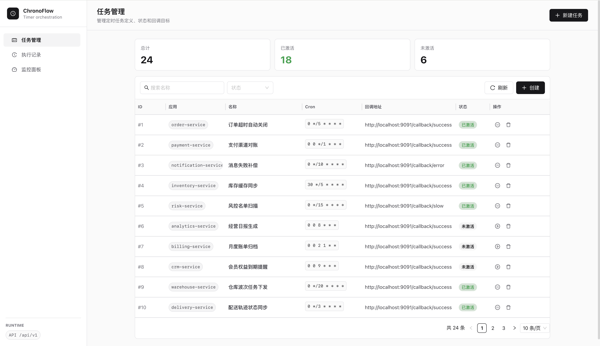
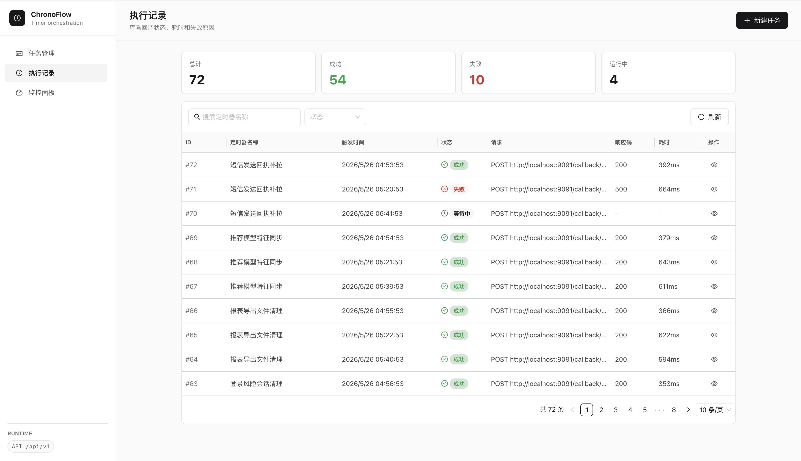
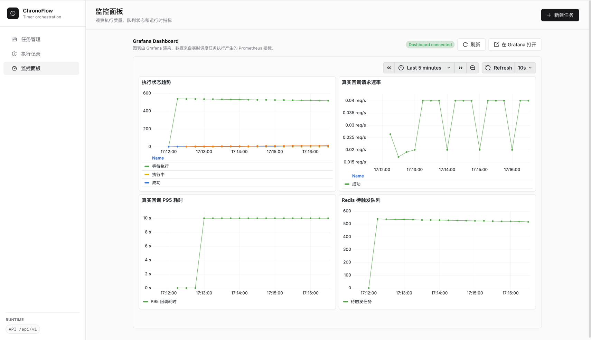
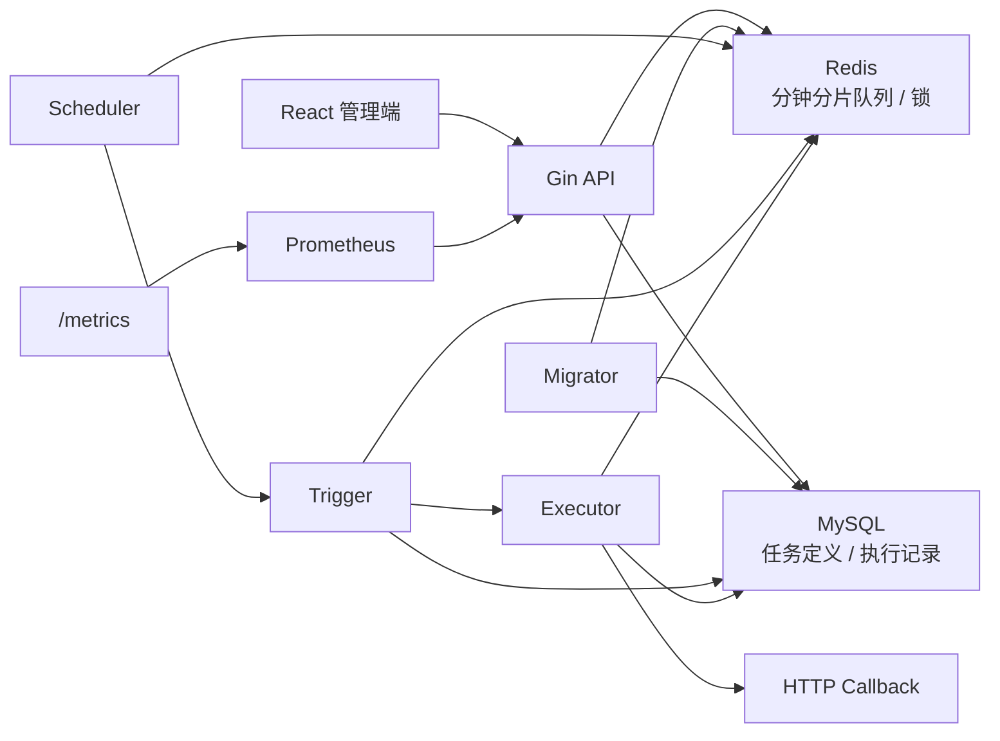

# ChronoFlow

ChronoFlow 是一个使用 Go 实现的定时任务调度服务。用户定义 Cron 规则和 HTTP 回调，系统在触发时间生成并执行回调任务，同时通过管理端查看任务、执行记录和运行状态。

## 重要功能

- **任务管理**：创建带六段式 Cron 表达式的 HTTP 回调任务，支持列表查询、名称搜索、状态筛选、激活、停用和逻辑删除。
- **回调执行记录**：记录触发时间、执行状态、请求信息、响应结果、错误信息和执行耗时；管理端支持按任务名称和状态筛选、查看详情。
- **调度执行**：激活任务时立即生成未来窗口内的执行记录，后台 Migrator 持续生成后续记录；Scheduler 按分钟时间片触发到期任务。
- **防重复执行**：执行记录以 `(timer_id, trigger_time)` 唯一约束去重，Executor 通过 `PENDING -> RUNNING` 条件更新取得唯一执行权，并以 Bloom Filter 辅助过滤已成功执行的任务。
- **监控面板**：展示执行状态分布、P95 执行耗时趋势、异常任务趋势和 Redis 队列状态；耗时与异常趋势支持按时间点悬浮查看值，右上角展示最新值。
- **可观测性**：服务暴露 Prometheus 指标，管理端通过后端查询 Prometheus 历史数据；Docker Compose 提供 Prometheus 和 Grafana 运行环境。

## 界面展示

### 任务管理

[](./images/任务管理.png)

### 执行记录

[](./images/执行记录.png)

### 监控面板

[](./images/监控面板.png)

## 核心设计

### 数据与调度链路



### 调度模型

1. 新建任务默认处于 `INACTIVE` 状态；激活后，服务根据 Cron 表达式立即创建未来时间窗口内的 `PENDING` 执行记录并写入 Redis。
2. Migrator 周期性扫描 `ACTIVE` 任务，为后续窗口创建执行记录并投递到 Redis。
3. Redis 使用分钟级 ZSet 队列，按投递规模在配置上限内动态增加桶数；Scheduler 扫描当前分钟和上一分钟的各个桶。
4. 多个服务实例通过 Redis `SET NX` 分片锁竞争调度权；Trigger 同时合并 MySQL 中的 `PENDING` 记录，补偿 Redis 投递不完整的情况。
5. Executor 只有在原子抢占执行记录成功后才发送 HTTP 请求，并将结果更新为 `SUCCESS` 或 `FAILED`。

### 状态模型

任务状态：

```text
INACTIVE --激活--> ACTIVE --停用--> INACTIVE
    |                 |
    +------删除-------+----> DELETED
```

执行记录状态：

```text
PENDING --> RUNNING --> SUCCESS | FAILED
```

任务定义创建后没有编辑接口；需要调整 Cron 或回调参数时，创建新的任务定义。

## 技术栈

| 模块 | 实现 |
| --- | --- |
| 后端 | Go、Gin、GORM、Viper、Zap |
| 数据存储 | MySQL 8.0、Redis 7 |
| 调度组件 | robfig/cron、ants 协程池 |
| 指标与历史 | prometheus/client_golang、Prometheus、Grafana |
| 管理端 | React、TypeScript、Vite、Ant Design |
| 本地运行环境 | Docker Compose |

## 快速开始

### 环境要求

- Go 1.26.2+
- Node.js 20.19+
- Docker 与 Docker Compose

### 1. 启动基础服务

```bash
make dev-start
```

该命令启动 MySQL、Redis、Prometheus 和 Grafana。


### 2. 启动后端

```bash
make dev-app
```

服务地址：

| 服务 | 地址 |
| --- | --- |
| API | `http://localhost:8080/api/v1` |
| Prometheus 指标 | `http://localhost:8080/metrics` |
| 健康检查 | `http://localhost:8080/health` |
| Prometheus | `http://localhost:9090` |
| Grafana | `http://localhost:3001` |

### 3. 启动管理端

```bash
cd web
npm install
npm run dev
```

管理端访问地址为 `http://localhost:3000`，开发服务器会将 `/api` 请求代理到后端服务。

### 4. 可选：启动回调测试服务

```bash
make test-callback
```

测试服务监听 `http://localhost:9091`，提供以下回调目标：

| 路径 | 行为 |
| --- | --- |
| `/callback/success` | 返回成功响应 |
| `/callback/slow` | 延迟 10 秒后返回成功响应 |
| `/callback/error` | 返回 HTTP 500 |
| `/stats` | 返回各回调的调用次数 |

## API 概览

| 方法 | 路径 | 用途 |
| --- | --- | --- |
| `POST` | `/api/v1/timers` | 创建任务 |
| `GET` | `/api/v1/timers` | 分页查询任务 |
| `GET` | `/api/v1/timers/:id` | 查询任务详情 |
| `DELETE` | `/api/v1/timers/:id` | 逻辑删除任务 |
| `POST` | `/api/v1/timers/:id/activate` | 激活任务 |
| `POST` | `/api/v1/timers/:id/deactivate` | 停用任务 |
| `GET` | `/api/v1/timers/:id/records` | 查询指定任务的执行记录 |
| `GET` | `/api/v1/records` | 分页查询执行记录 |
| `GET` | `/api/v1/records/:id` | 查询执行记录详情 |
| `GET` | `/api/v1/monitoring/summary` | 查询当前监控摘要 |
| `GET` | `/api/v1/monitoring/history` | 查询 Prometheus 历史趋势 |

## 关键配置

配置文件为 `config/config.yaml`：

| 配置项 | 默认值 | 作用 |
| --- | --- | --- |
| `scheduler.migrate_step_minutes` | `60` | 后续执行记录生成周期 |
| `scheduler.base_bucket_num` | `1` | 每分钟初始桶数 |
| `scheduler.bucket_num` | `3` | 每分钟动态扩桶上限 |
| `scheduler.tasks_per_bucket` | `100` | 每桶目标投递数量 |
| `scheduler.scan_interval` | `1` | Scheduler 扫描间隔（秒） |
| `executor.worker_pool_size` | `100` | 调度与执行共享协程池大小 |
| `monitoring.collect_interval_seconds` | `10` | 当前状态指标采集间隔（秒） |
| `monitoring.pending_overdue_seconds` | `120` | 等待执行异常阈值（秒） |
| `monitoring.running_stale_seconds` | `60` | 执行中异常阈值（秒） |
| `monitoring.prometheus_url` | `http://localhost:9090` | 历史趋势查询目标 |

## 构建与验证

```bash
go test ./...
cd web && npm run lint && npm run build
```

构建后的前端资源位于 `web/dist`，后端会提供该目录的静态页面服务。
