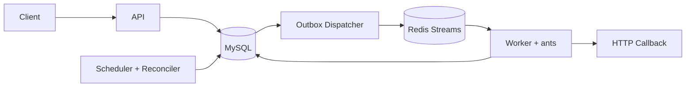

# ChronoFlow

ChronoFlow 是一个 Go 实现的分布式定时任务调度系统。项目只有一套运行架构：MySQL 保存权威调度状态和执行状态，Transactional Outbox 保证任务不会因 MySQL/Redis 双写失败而丢失，Redis Streams 负责跨进程投递，Worker 使用 ants 控制单实例并发。

同一个 `chronoflow` 二进制支持多个角色，但各角色是独立进程，可以分别构建镜像、扩缩容和部署到不同机器。这是“共享制品、多角色部署”，不是要求所有组件运行在同一进程。

## 架构



| 角色 | 职责 | 依赖 | 扩容方式 |
| --- | --- | --- | --- |
| `api` | Timer 管理、执行查询、监控接口、静态前端 | MySQL | 无状态横向扩容 |
| `scheduler` | 领取到期 Timer、创建 Execution/Outbox、推进 `next_fire_at`、恢复异常执行 | MySQL | 多副本，MySQL `SKIP LOCKED` 协调 |
| `dispatcher` | 将已提交 Outbox 可靠发布到 Redis Streams | MySQL、Redis | 多副本，Outbox Lease 协调 |
| `worker` | Consumer Group 消费、MySQL Lease 抢占、ants 并发执行回调、重试 | MySQL、Redis | 按回调吞吐横向扩容 |
| `all` | 在一个进程中运行全部角色 | MySQL、Redis | 仅用于本地开发或小规模演示 |

核心语义：

- `(timer_id, scheduled_at)` 唯一键保证同一计划触发点只生成一条执行记录。
- Execution、`next_fire_at` 和 Outbox 在同一个 MySQL 事务内提交。
- Redis Streams 是至少一次投递；Worker 通过 MySQL Lease 和 `run_token` 抵御重复消息与过期结果。
- Redis 暂时不可用时，Scheduler 仍可继续写 Outbox；恢复后 Dispatcher 自动补投。
- API 和 Scheduler 不依赖 Redis，Dispatcher 和 Worker 才依赖 Redis。

详细设计见 [架构说明](docs/1-architecture.md)、[调度算法](docs/3-scheduler.md) 和 [并发控制](docs/4-distributed-lock.md)。

## 快速启动

要求：Go 1.24+、Node.js 20+、Docker Compose。

启动完整的多角色环境：

```bash
docker compose up -d --build
```

服务地址：

- API/UI：`http://localhost:8080`
- Scheduler 健康与指标：`http://localhost:8081`
- Dispatcher 健康与指标：`http://localhost:8082`
- Worker 健康与指标：`http://localhost:8083`
- Prometheus：`http://localhost:9090`
- Grafana：`http://localhost:3001`

本地开发可先启动依赖，再运行组合角色：

```bash
make dev-start
make dev-app
make dev-frontend
```

也可以在不同终端分别运行四个角色：

```bash
make dev-api
make dev-scheduler
make dev-dispatcher
make dev-worker
```

## 构建与测试

```bash
make build
make test
go vet ./...
docker compose config
```

后端只产生一个制品：

```bash
go build -o bin/chronoflow ./cmd/chronoflow
./bin/chronoflow api
./bin/chronoflow scheduler
./bin/chronoflow dispatcher
./bin/chronoflow worker
```

生产环境可以使用同一个镜像，以不同启动参数创建四类 Deployment。Worker 和 Scheduler 的副本数可以独立调整。

## 创建任务

ChronoFlow 使用六字段 Cron：`秒 分 时 日 月 周`。创建后 Timer 默认为 `INACTIVE`，激活时才计算第一个 `next_fire_at`。

```bash
curl -X POST http://localhost:8080/api/v1/timers \
  -H 'Content-Type: application/json' \
  -d '{
    "app": "demo",
    "name": "heartbeat",
    "cron_expr": "0 * * * * *",
    "callback_url": "https://example.com/jobs/heartbeat",
    "callback_method": "POST",
    "callback_body": "{\"source\":\"chronoflow\"}",
    "timezone": "Asia/Shanghai",
    "misfire_policy": "FIRE_ONCE",
    "max_catch_up": 10
  }'

curl -X POST http://localhost:8080/api/v1/timers/1/activate
```

生产环境设置 `security.api_key` 后，请求还需携带：

```bash
-H 'X-API-Key: your-secret'
```

## API

| 方法 | 路径 | 说明 |
| --- | --- | --- |
| `POST` | `/api/v1/timers` | 创建 Timer |
| `GET` | `/api/v1/timers` | 分页查询 Timer |
| `GET` | `/api/v1/timers/:id` | Timer 详情 |
| `DELETE` | `/api/v1/timers/:id` | 逻辑删除 Timer |
| `POST` | `/api/v1/timers/:id/activate` | 激活 |
| `POST` | `/api/v1/timers/:id/deactivate` | 停用 |
| `GET` | `/api/v1/executions` | 分页查询 Execution |
| `GET` | `/api/v1/executions/:id` | Execution 详情 |
| `GET` | `/api/v1/timers/:id/executions` | Timer 最近执行 |
| `GET` | `/api/v1/monitoring/summary` | 运行摘要 |
| `GET` | `/api/v1/monitoring/history` | Prometheus 历史数据 |
| `GET` | `/health` | 进程存活 |
| `GET` | `/ready` | 当前角色依赖就绪 |
| `GET` | `/metrics` | Prometheus 指标 |

完整参数见 [API 文档](docs/6-api-reference.md)。

## 配置

默认配置位于 [`config/config.yaml`](config/config.yaml)。任意配置都可以通过 `CHRONOFLOW_` 环境变量覆盖，例如：

```bash
CHRONOFLOW_SERVER_PORT=8081
CHRONOFLOW_DATABASE_DSN='user:pass@tcp(mysql:3306)/chronoflow?charset=utf8mb4&parseTime=True&loc=UTC'
CHRONOFLOW_REDIS_ADDR='redis:6379'
CHRONOFLOW_SECURITY_API_KEY='replace-me'
```

关键配置：

| 配置 | 含义 |
| --- | --- |
| `scheduler.poll_interval_ms` | 到期 Timer 扫描间隔 |
| `scheduler.batch_size` | 单事务领取上限 |
| `database.auto_migrate` | 仅本地开发启用；生产保持 `false` |
| `outbox.*` | Outbox 领取、重试与 Stream 名称 |
| `worker.pool_size` | 单 Worker 进程 ants 并发上限 |
| `worker.lease_ttl_seconds` | 执行所有权租约 |
| `recovery.*` | 异常恢复与历史保留 |
| `security.api_key` | API 访问密钥 |
| `security.allow_private_callbacks` | 是否允许内网回调；生产建议关闭 |

## 数据库迁移

生产环境按文件名顺序执行 [`migrations`](migrations)，且只由发布流程中的单一迁移任务执行。不要让多个业务副本并发执行迁移。

`004_remove_obsolete_scheduler.sql` 会删除旧 `timer_records` 表。升级既有环境时，应先归档需要保留的数据，再执行该迁移。应用不会自动删除旧 Redis Key；确认旧进程全部停止后，可按旧项目前缀做一次受控清理。

所有调度时间按 UTC 写入 MySQL，Timer 的 `timezone` 仅用于 Cron 计算和展示语义。

## 交付边界

当前实现提供生产级 MVP 所需的任务生成、可靠投递、重复防护、失败重试、崩溃恢复、健康检查、安全基线和监控。它不提供 DAG、分片计算任务、人工审批、多租户资源隔离或 Kafka 级别的超大吞吐；这些属于后续产品演进范围。
