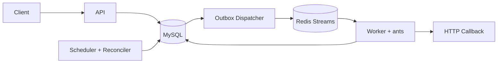

# ChronoFlow

ChronoFlow 是一个 Go 实现的分布式定时任务调度系统。MySQL 保存 Timer、Execution 和 Outbox 状态；Scheduler 创建执行记录和 Outbox 事件；Dispatcher 发布 Redis Streams 消息；Worker 使用 ants 执行 HTTP 回调。

系统包含四个独立角色：API、Scheduler、Dispatcher、Worker。它们共享代码仓库、领域模型和 MySQL/Redis 协作协议，可分别构建、启动和扩缩容。`all` 提供组合运行模式；`migrate` 提供数据库迁移命令。

## 架构



| 角色 | 职责 | 依赖 | 扩容方式 |
| --- | --- | --- | --- |
| `api` | Timer 管理、执行查询、监控接口、静态前端 | MySQL | 无状态横向扩容 |
| `scheduler` | 领取到期 Timer、创建 Execution/Outbox、推进 `next_fire_at`、恢复异常执行 | MySQL | 多副本，MySQL `SKIP LOCKED` 协调 |
| `dispatcher` | 将已提交 Outbox 发布到 Redis Streams | MySQL、Redis | 多副本，Outbox Lease 协调 |
| `worker` | Consumer Group 消费、MySQL Lease 抢占、ants 并发执行回调、重试 | MySQL、Redis | 按回调吞吐横向扩容 |
| `all` | 在一个进程中运行全部角色 | MySQL、Redis | 组合运行模式 |

构建产物：

```text
chronoflow-api
chronoflow-scheduler
chronoflow-dispatcher
chronoflow-worker
chronoflow-migrate            # 数据库迁移命令
chronoflow-all                # 组合运行模式
```

核心语义：

- `(timer_id, scheduled_at)` 唯一键约束同一计划触发点对应一条执行记录。
- Execution、`next_fire_at` 和 Outbox 在同一个 MySQL 事务内提交。
- Redis Streams 使用 Consumer Group 投递；Worker 通过 MySQL Lease 和 `run_token` 管理执行所有权与结果写入。
- Dispatcher 按 Outbox 状态发布 Redis Streams 消息，并记录发布结果与重试时间。

## 快速启动

服务端开发要求 Go 1.26.2+ 与 Docker Compose；前端开发要求 Node.js 22+。

本地开发时，在一个终端启动完整后端：

```bash
make dev-backend
```

它会依次启动 Docker 基础依赖、执行待应用的数据库迁移，并以组合运行模式启动 API、Scheduler、Dispatcher 和 Worker。

在另一个终端启动前端开发服务器：

```bash
make dev-frontend
```

Docker Compose 启动 MySQL、Redis、Prometheus 和 Grafana。前端开发服务器会将 `/api` 请求代理至 API 角色的 `http://localhost:8080`。

服务地址：

- API/UI：`http://localhost:8080`
- Scheduler 健康与指标：`http://localhost:8081`
- Dispatcher 健康与指标：`http://localhost:8082`
- Worker 健康与指标：`http://localhost:8083`
- Prometheus：`http://localhost:9090`
- Grafana：`http://localhost:3001`

如需分别调试每个后端角色，先手动启动基础依赖并执行迁移：

```bash
docker compose up -d mysql redis prometheus grafana
go run ./cmd/migrate up
```

再在不同终端分别运行：

```bash
make dev-api
make dev-scheduler
make dev-dispatcher
make dev-worker
```

## 构建与测试

```bash
make build
make test
go vet ./...
docker compose config
```

真实 MySQL、Redis 和四个独立角色进程的端到端测试：

```bash
make e2e-test
make e2e-down  # 测试完成或排障后清理 E2E 容器
```

详细说明与覆盖场景见 [`e2e/README.md`](e2e/README.md)。

`make build` 会在 `bin/` 中生成独立产物：

```bash
bin/chronoflow-api
bin/chronoflow-scheduler
bin/chronoflow-dispatcher
bin/chronoflow-worker
bin/chronoflow-migrate
bin/chronoflow-all
```

## 创建任务

ChronoFlow 使用六字段 Cron：`秒 分 时 日 月 周`。创建后 Timer 默认为 `INACTIVE`，激活时才计算第一个 `next_fire_at`。

```bash
curl -X POST http://localhost:8080/api/v1/timers \
  -H 'Content-Type: application/json' \
  -d '{
    "app": "demo",
    "name": "heartbeat",
    "cron_expr": "0 * * * * *",
    "callback_url": "https://example.com/jobs/heartbeat",
    "callback_method": "POST",
    "callback_body": "{\"source\":\"chronoflow\"}",
    "misfire_policy": "FIRE_ONCE",
    "max_catch_up": 10
  }'

curl -X POST http://localhost:8080/api/v1/timers/1/activate
```

生产环境设置 `security.api_key` 后，请求还需携带：

```bash
-H 'X-API-Key: your-secret'
```

## API

| 方法 | 路径 | 说明 |
| --- | --- | --- |
| `POST` | `/api/v1/timers` | 创建 Timer |
| `GET` | `/api/v1/timers` | 分页查询 Timer |
| `GET` | `/api/v1/timers/:id` | Timer 详情 |
| `DELETE` | `/api/v1/timers/:id` | 逻辑删除 Timer |
| `POST` | `/api/v1/timers/:id/activate` | 激活 |
| `POST` | `/api/v1/timers/:id/deactivate` | 停用 |
| `GET` | `/api/v1/executions` | 分页查询 Execution |
| `GET` | `/api/v1/executions/:id` | Execution 详情 |
| `GET` | `/api/v1/timers/:id/executions` | Timer 最近执行 |
| `GET` | `/api/v1/monitoring/summary` | 运行摘要 |
| `GET` | `/api/v1/monitoring/history` | Prometheus 历史数据 |
| `GET` | `/health` | 进程存活 |
| `GET` | `/ready` | 当前角色依赖就绪 |
| `GET` | `/metrics` | Prometheus 指标 |

## 配置

默认配置位于 [`config/config.yaml`](config/config.yaml)。任意配置都可以通过 `CHRONOFLOW_` 环境变量覆盖，例如：

```bash
CHRONOFLOW_SERVER_PORT=8081
CHRONOFLOW_DATABASE_DSN='user:pass@tcp(mysql:3306)/chronoflow?charset=utf8mb4&parseTime=True&loc=Local'
CHRONOFLOW_REDIS_ADDR='redis:6379'
CHRONOFLOW_SECURITY_API_KEY='replace-me'
```

关键配置：

| 配置 | 含义 |
| --- | --- |
| `scheduler.poll_interval_ms` | 到期 Timer 扫描间隔 |
| `scheduler.batch_size` | 单事务领取上限 |
| `migrations.path` | 版本化 SQL 迁移目录，默认 `migrations` |
| `outbox.*` | Outbox 领取、重试与 Stream 名称 |
| `worker.pool_size` | 单 Worker 进程 ants 并发上限 |
| `worker.lease_ttl_seconds` | 执行所有权租约 |
| `recovery.*` | 异常恢复与历史保留 |
| `security.api_key` | API 访问密钥 |
| `security.allow_private_callbacks` | 内网回调地址校验开关 |

## 数据库迁移

迁移由项目内嵌的 `golang-migrate` 执行，并自动维护 MySQL 的 `schema_migrations` 版本表。迁移文件按版本顺序执行：

```text
migrations/
├── 00001_init.up.sql
└── 00001_init.down.sql
```

常用命令：

```bash
make migrate-version
make migrate-down STEPS=1

# 等价的 Go 命令
go run ./cmd/migrate up
go run ./cmd/migrate version
go run ./cmd/migrate down 1
```

迁移在 DSN 指定的 MySQL 数据库中创建和维护表结构，并由 `schema_migrations` 记录版本。首次迁移前创建 DSN 指定的数据库；`up` 执行待执行版本，`down` 按步数回滚版本，`force` 设置迁移版本。

### 时间约定

ChronoFlow 使用当前时间读写 MySQL `DATETIME` 字段，DSN 使用 `loc=Local`。
