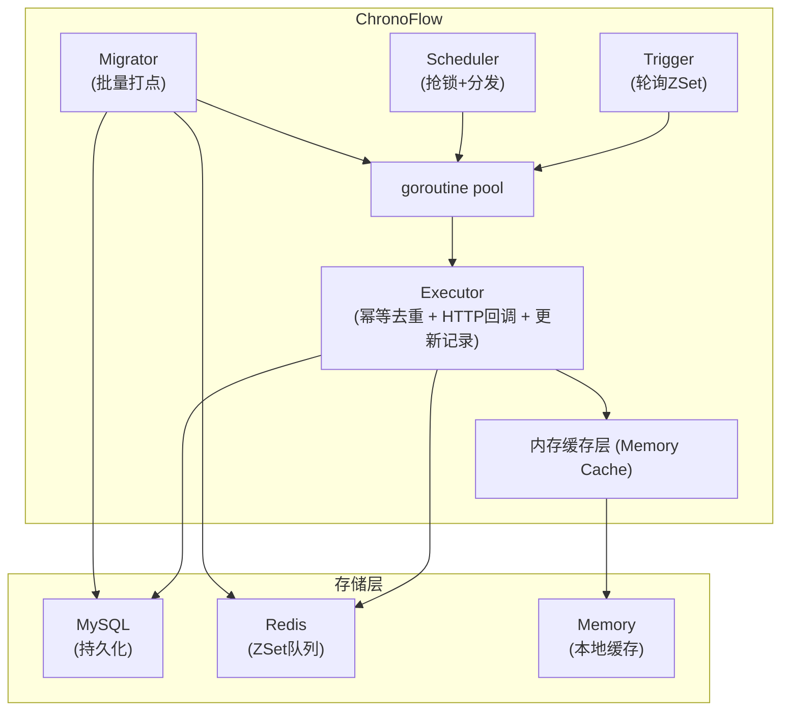
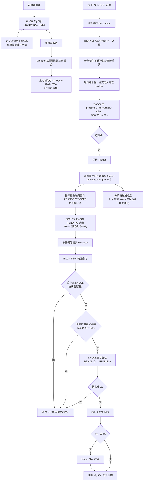

# ChronoFlow - Go 分布式定时任务调度系统

采用**时间分片 + 分桶并发 + 三级存储**设计的分布式定时任务调度系统，支持 Cron 表达式定时、HTTP 回调、幂等去重、分布式锁等能力。

## 核心特性

| 特性 | 说明 |
|------|------|
| **时间分片** | 按分钟级时间范围切分 Redis ZSet，减少单次查询量 |
| **分桶并发** | 按 `timer_id % bucket_num` 分桶，每桶独立 goroutine 并发处理 |
| **三级存储** | MySQL → Redis ZSet → 节点内存缓存，逐级加速 |
| **执行幂等** | Bloom 快速过滤 + 唯一业务键 + MySQL 原子状态抢占 |
| **分布式锁** | Scheduler 对每个分片 SETNX 抢锁，多实例互斥 |
| **协程池** | ants 协程池控制并发数，防止资源耗尽 |
| **Prometheus** | 内置指标采集（执行次数/耗时/成功率/队列深度） |

## 技术栈

| 组件 | 技术 |
|------|------|
| 语言 | Go 1.26.2+ |
| Web 框架 | Gin |
| ORM | GORM |
| 数据库 | MySQL 8.0 |
| 缓存与队列 | Redis 7（ZSet + SETNX 锁 + Bitmap） |
| Cron 解析 | robfig/cron/v3 |
| 日志 | zap |
| 配置 | viper |
| 协程池 | panjf2000/ants/v2 |
| 指标 | prometheus/client_golang |
| 前端 | React + TypeScript + Ant Design |
| 容器化 | Docker / Docker Compose |

## 系统架构



### 核心流程



## 项目结构

```
ChronoFlow/
├── cmd/server/main.go                    # 程序入口
├── config/config.yaml                    # 配置文件
├── internal/
│   ├── config/config.go                  # Viper 配置管理
│   ├── model/
│   │   ├── timer_definition.go           # 定时器定义模型
│   │   ├── timer_record.go               # 执行记录模型
│   │   └── state_machine.go              # 状态机定义
│   ├── repository/
│   │   ├── database.go                   # GORM MySQL 初始化
│   │   ├── timer_definition_repo.go      # 定时器定义 CRUD
│   │   └── timer_record_repo.go          # 执行记录 CRUD
│   ├── service/
│   │   ├── migrator.go                   # 一级迁移（MySQL → Redis）
│   │   ├── scheduler.go                  # 调度器（抢锁 + 分发）
│   │   ├── trigger.go                    # 触发器（轮询 ZSet）
│   │   ├── executor.go                   # 执行器（幂等 + 回调）
│   │   └── timer_service.go              # 定时器 CRUD 业务逻辑
│   ├── handler/
│   │   └── timer_handler.go              # HTTP API 处理器
│   ├── middleware/
│   │   ├── cors.go                       # CORS 中间件
│   │   └── logger.go                     # 请求日志中间件
│   └── pkg/
│       ├── bloom/filter.go               # Redis 布隆过滤器
│       ├── cron/parser.go                # Cron 表达式解析器
│       ├── memory/cache.go               # 内存定时器缓存
│       ├── metrics/reporter.go           # Prometheus 指标上报
│       ├── pool/pool.go                  # ants 协程池
│       └── redis/queue.go                # Redis ZSet 队列 + SETNX 锁
├── pkg/logger/logger.go                  # zap 日志封装
├── web/                                  # React 前端
├── tests/callback-server/main.go         # 测试回调服务
├── migrations/001_init.sql               # 数据库初始化脚本
├── docker-compose.yml                    # Docker 编排
├── Dockerfile                            # 多阶段构建
├── Makefile                              # 开发命令
└── docs/                                 # 项目文档
```

## 快速开始

### 环境要求

- Go 1.26.2+
- Node.js 18+（前端开发）
- MySQL 8.0+
- Redis 7.0+

### 1. 启动基础设施

```bash
# 启动 MySQL + Redis
make docker-up
```

### 2. 初始化数据库

```bash
# 方式一：手动执行 SQL
mysql -u root -p123456 < migrations/001_init.sql

# 方式二：程序启动时自动迁移（GORM AutoMigrate）
# 无需手动执行，程序会自动创建表结构
```

### 3. 配置

编辑 `config/config.yaml`，确认数据库和 Redis 连接信息：

```yaml
database:
  dsn: "root:123456@tcp(127.0.0.1:3306)/chronoflow?charset=utf8mb4&parseTime=True&loc=Local"

redis:
  addr: "127.0.0.1:6379"
```

### 4. 启动后端

```bash
make dev-backend
# 或
go run cmd/server/main.go
```

服务启动后：
- API: http://localhost:8080/api/v1/timers
- Prometheus: http://localhost:8080/metrics
- 健康检查: http://localhost:8080/health

### 5. 启动前端

```bash
make dev-frontend
# 或
cd web && npm install && npm run dev
```

前端访问: http://localhost:3000

## 测试步骤

### 步骤一：启动测试回调服务

```bash
make test-callback
# 或
go run tests/callback-server/main.go
```

测试回调服务监听在 `http://localhost:9090`，提供以下接口：

| 接口 | 说明 |
|------|------|
| `POST /callback/success` | 立即返回成功 |
| `POST /callback/slow` | 延迟 10 秒后返回 |
| `POST /callback/error` | 返回 500 错误 |
| `GET /stats` | 查看调用统计 |

### 步骤二：创建定时器

```bash
# 创建一个每 30 秒触发的定时器
curl -X POST http://localhost:8080/api/v1/timers \
  -H "Content-Type: application/json" \
  -d '{
    "app": "test",
    "name": "测试定时器-30秒",
    "cron_expr": "*/30 * * * * *",
    "callback_url": "http://localhost:9090/callback/success",
    "callback_method": "POST",
    "callback_body": "{\"msg\": \"hello\"}"
  }'
```

预期响应：

```json
{
  "code": 201,
  "message": "创建成功",
  "data": {
    "id": 1,
    "app": "test",
    "name": "测试定时器-30秒",
    "status": "INACTIVE",
    ...
  }
}
```

### 步骤三：激活定时器

```bash
# 激活定时器（ID=1）
curl -X POST http://localhost:8080/api/v1/timers/1/activate
```

激活后，Migrator 会自动预创建执行记录并推入 Redis 队列。

### 步骤四：观察执行结果

```bash
# 查看定时器列表
curl http://localhost:8080/api/v1/timers

# 查看执行记录
curl http://localhost:8080/api/v1/records

# 查看指定定时器的执行记录
curl http://localhost:8080/api/v1/timers/1/records

# 查看测试回调服务统计
curl http://localhost:9090/stats
```

### 步骤五：测试慢回调

```bash
# 创建一个指向慢接口的定时器
curl -X POST http://localhost:8080/api/v1/timers \
  -H "Content-Type: application/json" \
  -d '{
    "app": "test",
    "name": "测试超时",
    "cron_expr": "*/30 * * * * *",
    "callback_url": "http://localhost:9090/callback/slow",
    "callback_method": "POST"
  }'
```

### 步骤六：查看 Prometheus 指标

```bash
# 访问 Prometheus 指标端点
curl http://localhost:8080/metrics

# 关键指标：
# chronoflow_timer_exec_total - 执行总次数
# chronoflow_timer_exec_duration_ms - 执行耗时分布
# chronoflow_timer_exec_success_total - 成功次数
# chronoflow_timer_exec_failed_total - 失败次数
```

### 步骤七：多实例部署测试

```bash
# 启动第二个实例（不同端口）
PORT=8081 go run cmd/server/main.go

# 两个实例会通过分布式锁自动协调，不会重复执行
```

## 配置说明

| 配置项 | 默认值 | 说明 |
|--------|--------|------|
| `scheduler.migrate_step_minutes` | 60 | Migrator 执行间隔（分钟） |
| `scheduler.step2_duration` | 120 | 二级迁移时间步（秒），本地定义及状态缓存有效期（2 分钟） |
| `scheduler.base_bucket_num` | 1 | 单分钟基础桶数 |
| `scheduler.bucket_num` | 3 | 单分钟动态扩桶上限 |
| `scheduler.tasks_per_bucket` | 100 | 每桶目标投递任务数 |
| `scheduler.bucket_metadata_ttl` | 600 | 时间片结束后队列与分桶元数据保留秒数 |
| `scheduler.scan_interval` | 1 | Scheduler 轮询间隔（秒） |
| `scheduler.lock_expiration` | 70 | 分片锁初始 TTL（秒） |
| `scheduler.success_expiration` | 130 | 分片扫描成功后的锁保留 TTL（秒） |
| `executor.worker_pool_size` | 100 | 协程池大小 |

## Redis Key 结构

| 用途 | Key 格式 | 类型 |
|------|----------|------|
| 任务队列 | `chronoflow:timer:{YYYY-MM-DD-HH:mm}:{bucket}` | ZSet |
| 分桶数量 | `chronoflow:bucket:{YYYY-MM-DD-HH:mm}` | String |
| 投递计数 | `chronoflow:task_count:{YYYY-MM-DD-HH:mm}` | String |
| Scheduler 锁 | `chronoflow:scheduler_lock:{time_range}:{bucket}` | String (owner token, SET NX TTL) |
| 布隆过滤器 | `chronoflow:bloom:{date}` | String (bitmap) |

## 定时器状态流转

```
INACTIVE ──激活──→ ACTIVE ──停用──→ INACTIVE
    │                 │
    └────删除────────→ DELETED（终态）
```

定时器定义创建后不可修改；需要变更 Cron 或回调配置时，应删除旧定时器并新建。停用或删除不会清理 Redis ZSet 中已经生成的任务点。与 xTimer 一致，Executor 使用包含状态的节点本地定义缓存判断是否执行，因此停用或删除可能在一个 `step2_duration` 周期内仍有回调；缓存失效后非 `ACTIVE` 任务会被跳过。

## 文档

- [系统架构详解](docs/1-architecture.md)
- [调度器模块详解](docs/3-scheduler.md)
- [分布式锁与幂等](docs/4-distributed-lock.md)
- [API 接口文档](docs/6-api-reference.md)

## 许可证

MIT License
