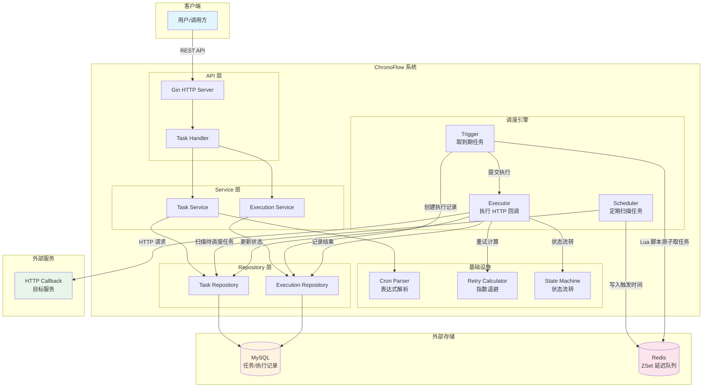
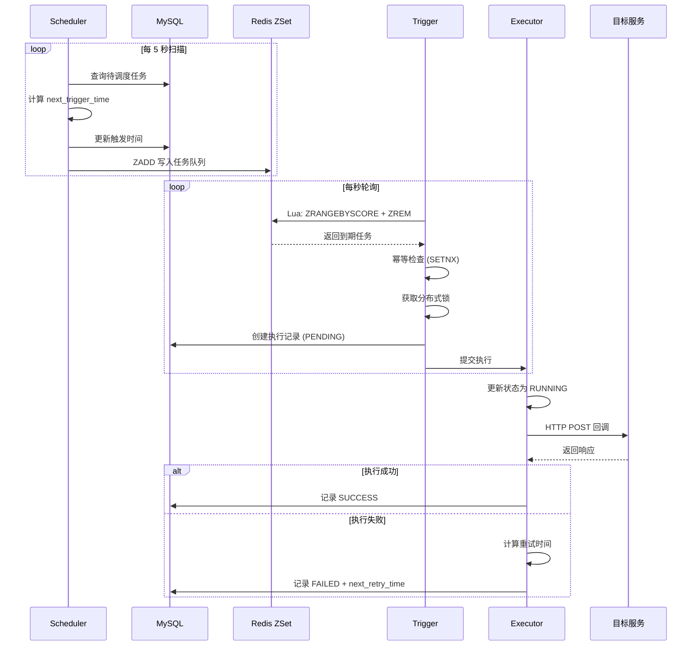
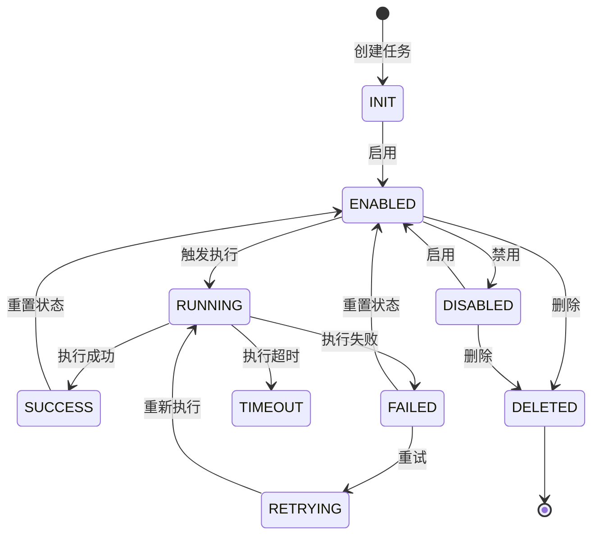

# ChronoFlow - Go 分布式定时任务调度系统

一个基于 Go 实现的分布式定时任务调度系统，支持 Cron 表达式、任务 CRUD、HTTP Callback、手动触发、执行日志、失败重试和超时控制。

## 功能特性

### 第一阶段：基础功能

- **任务 CRUD**：创建、查询、更新、删除任务
- **任务启用/禁用**：灵活控制任务状态
- **Cron 表达式解析**：支持标准 Cron 表达式（秒级精度）
- **Redis ZSet 延迟触发**：使用 Redis 有序集合管理任务触发时间
- **HTTP Callback**：执行 HTTP 回调通知
- **执行日志**：记录每次执行的详细信息

### 第二阶段：可靠性增强

- **任务状态机**：完整的任务生命周期管理（INIT → ENABLED → RUNNING → SUCCESS/FAILED）
- **失败重试**：指数退避重试策略（10s → 30s → 60s）
- **超时控制**：HTTP 回调超时检测和处理
- **手动触发**：支持手动执行任务
- **幂等控制**：防止同一任务在同一时间被重复执行

### 第三阶段：分布式能力（已完成）

- **Redis Lua 原子取任务**：保证任务获取的原子性
- **分布式锁**：防止多实例重复执行
- **宕机恢复**：超时任务自动重新调度

## 技术栈

| 组件 | 技术 |
|------|------|
| 语言 | Go 1.26.2+ |
| Web 框架 | Gin |
| 数据库 | MySQL / PostgreSQL |
| 缓存与队列 | Redis ZSet |
| Cron 解析 | robfig/cron |
| 日志 | zap |
| 配置 | viper |
| 前端 | React + TypeScript + Ant Design |
| 前端构建 | Vite |
| 容器化 | Docker / Docker Compose |

## 系统架构



### 核心调度流程



### 任务状态机



## 项目结构

```
ChronoFlow/
├── cmd/
│   └── server/
│       └── main.go              # 程序入口
├── internal/
│   ├── config/
│   │   └── config.go            # 配置管理
│   ├── model/
│   │   ├── task.go              # 任务模型
│   │   ├── task_execution.go    # 执行记录模型
│   │   └── state_machine.go     # 状态机定义
│   ├── repository/
│   │   ├── database.go          # 数据库初始化
│   │   ├── task_repository.go   # 任务数据访问
│   │   └── execution_repository.go # 执行记录数据访问
│   ├── service/
│   │   ├── task_service.go      # 任务业务逻辑
│   │   ├── execution_service.go # 执行记录业务逻辑
│   │   ├── scheduler.go         # 任务调度器
│   │   ├── trigger.go           # 任务触发器
│   │   └── executor.go          # HTTP 回调执行器
│   ├── handler/
│   │   └── task_handler.go      # HTTP API 处理器
│   ├── middleware/
│   │   └── logger.go            # 日志中间件
│   └── pkg/
│       ├── cron/
│       │   └── parser.go        # Cron 解析器
│       ├── redis/
│       │   └── queue.go         # Redis 任务队列
│       └── retry/
│           └── strategy.go      # 重试策略
├── pkg/
│   └── logger/
│       └── logger.go            # 日志工具
├── web/                         # 前端项目
│   ├── src/
│   │   ├── api/                 # API 客户端
│   │   ├── components/          # 公共组件
│   │   ├── layouts/             # 布局组件
│   │   ├── pages/               # 页面组件
│   │   │   ├── TaskList.tsx     # 任务列表
│   │   │   ├── TaskForm.tsx     # 任务表单
│   │   │   └── ExecutionList.tsx # 执行记录
│   │   ├── types/               # TypeScript 类型
│   │   └── utils/               # 工具函数
│   ├── package.json
│   └── vite.config.ts
├── config/
│   └── config.yaml              # 配置文件
├── migrations/
│   └── 001_init.sql             # 数据库初始化脚本
├── docker-compose.yml           # Docker Compose 配置
├── Dockerfile                   # Docker 镜像构建
├── go.mod                       # Go 模块定义
└── README.md                    # 项目文档
```

## 快速开始

### 环境要求

- Go 1.26.2+
- Node.js 18+ (前端开发)
- MySQL 8.0+ 或 PostgreSQL
- Redis 7.0+

### 本地开发

#### 后端开发

1. 克隆项目

```bash
git clone https://github.com/your-username/chronoflow.git
cd chronoflow
```

2. 安装依赖

```bash
go mod tidy
```

3. 配置数据库

编辑 `config/config.yaml`，配置数据库和 Redis 连接信息。

4. 初始化数据库

```bash
mysql -u root -p < migrations/001_init.sql
```

5. 启动后端服务

```bash
go run cmd/server/main.go
```

#### 前端开发

1. 进入前端目录

```bash
cd web
```

2. 安装依赖

```bash
npm install
```

3. 启动开发服务器

```bash
npm run dev
```

前端开发服务器将在 http://localhost:3000 启动，API 请求会自动代理到后端 http://localhost:8080。

4. 构建生产版本

```bash
npm run build
```

构建产物将输出到 `web/dist` 目录，后端会自动服务这些静态文件。

### Docker Compose 部署

1. 启动所有服务

```bash
docker-compose up -d
```

2. 查看日志

```bash
docker-compose logs -f chronoflow
```

3. 停止服务

```bash
docker-compose down
```

## API 文档

### 基础路径

```
http://localhost:8080/api/v1
```

### 任务管理

#### 创建任务

```http
POST /tasks
Content-Type: application/json

{
  "name": "数据备份任务",
  "description": "每天凌晨2点执行数据备份",
  "cron_expr": "0 0 2 * * *",
  "callback_url": "https://api.example.com/backup",
  "callback_method": "POST",
  "callback_body": "{\"type\":\"daily\"}",
  "callback_headers": {"Authorization": "Bearer token123"},
  "timeout": 60,
  "max_retries": 3
}
```

**响应：**

```json
{
  "code": 201,
  "message": "task created",
  "data": {
    "id": 1,
    "name": "数据备份任务",
    "status": "INIT",
    "next_trigger_time": "2024-01-02T02:00:00Z"
  }
}
```

#### 查询任务列表

```http
GET /tasks?page=1&page_size=20&status=ENABLED&keyword=备份
```

#### 获取任务详情

```http
GET /tasks/:id
```

#### 更新任务

```http
PUT /tasks/:id
Content-Type: application/json

{
  "name": "新任务名称",
  "timeout": 120
}
```

#### 删除任务

```http
DELETE /tasks/:id
```

#### 启用任务

```http
POST /tasks/:id/enable
```

#### 禁用任务

```http
POST /tasks/:id/disable
```

#### 手动触发任务

```http
POST /tasks/:id/trigger
```

### 执行记录

#### 查询执行记录列表

```http
GET /executions?page=1&page_size=20&task_id=1&status=SUCCESS
```

#### 获取执行记录详情

```http
GET /executions/:id
```

### 健康检查

```http
GET /health
```

## 任务状态流转

```
INIT → ENABLED → DISABLED
         ↓
      RUNNING → SUCCESS → ENABLED
         ↓
      FAILED → RETRYING → RUNNING
         ↓
      TIMEOUT → FAILED
         ↓
      DELETED
```

## Cron 表达式格式

系统支持标准 Cron 表达式，包含秒字段：

```
┌─────────────秒 (0-59)
│ ┌─────────────分 (0-59)
│ │ ┌─────────────时 (0-23)
│ │ │ ┌─────────────日 (1-31)
│ │ │ │ ┌─────────────月 (1-12)
│ │ │ │ │ ┌─────────────周 (0-6, 0=周日)
│ │ │ │ │ │
* * * * * *
```

**示例：**

| 表达式 | 说明 |
|--------|------|
| `0 0 2 * * *` | 每天凌晨 2 点 |
| `0 */5 * * * *` | 每 5 分钟 |
| `0 0 9-18 * * 1-5` | 工作日 9-18 点每小时 |
| `0 30 8 1 * *` | 每月 1 号 8:30 |

## 配置说明

配置文件位于 `config/config.yaml`：

```yaml
server:
  port: 8080
  mode: debug

database:
  driver: mysql
  dsn: "root:123456@tcp(127.0.0.1:3306)/chronoflow?charset=utf8mb4&parseTime=True&loc=Local"

redis:
  addr: "127.0.0.1:6379"
  password: ""
  db: 0

scheduler:
  scan_interval: 5
  batch_size: 100

executor:
  timeout: 30
  max_retries: 3
  worker_pool_size: 10

retry:
  strategy: exponential
  initial_interval: 10
  max_interval: 60
  multiplier: 3.0
```

## 设计亮点

### 1. 状态机设计

使用状态机管理任务生命周期，通过预定义的状态转换规则保证状态流转的合法性，防止非法状态变更。

### 2. Redis ZSet 延迟队列

利用 Redis ZSet 的特性（按 score 排序），将任务触发时间作为 score，实现高效的延迟任务调度。

### 3. 指数退避重试

失败重试采用指数退避策略（10s → 30s → 60s），避免在服务不可用时产生大量无效重试。

### 4. 幂等控制

通过 Redis SETNX 实现幂等键，保证同一任务在同一触发时间只会被执行一次。

### 5. 工作池控制

使用带缓冲的 channel 实现工作池，控制并发执行的任务数量，防止系统过载。

## 许可证

MIT License
