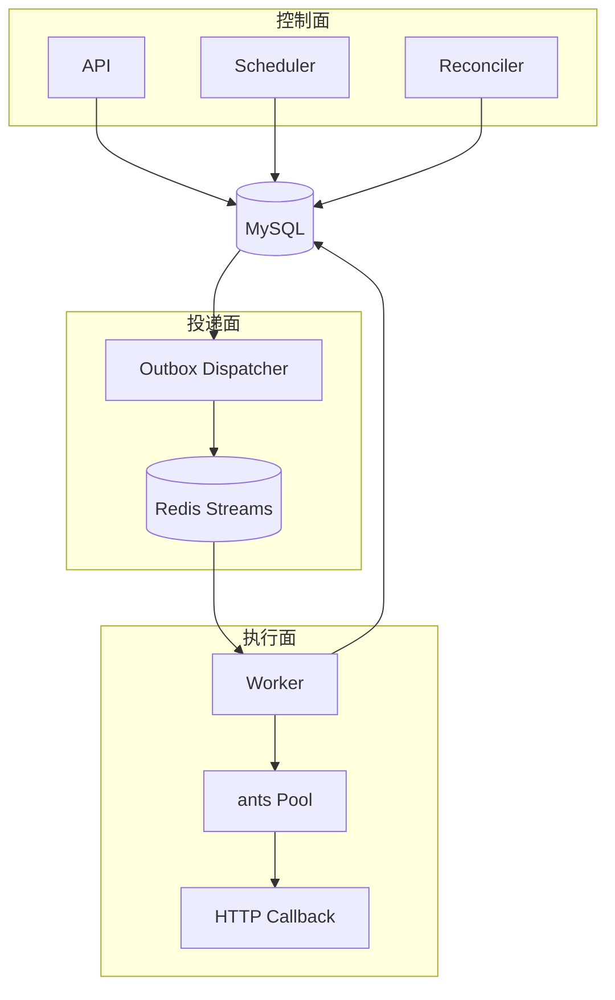

# ChronoFlow 架构

## 1. 设计目标

ChronoFlow 的目标是可靠地把“某个 Timer 在某个计划时间应执行一次”转换成一次可追踪的 HTTP 回调。系统采用控制面与执行面分离、MySQL 权威状态、至少一次消息投递和幂等状态迁移。

项目只有一套架构，不存在隐藏的兼容调度链。所有角色来自同一个二进制，但可作为独立进程或容器部署。

## 2. 组件与边界



### API

- 管理 Timer 的创建、查询、激活、停用和逻辑删除。
- 查询持久化 Execution。
- 提供健康检查、指标和管理页面。
- 只依赖 MySQL。

### Scheduler

- 查询 `status=ACTIVE AND next_fire_at<=now` 的 Timer。
- 使用 `SELECT ... FOR UPDATE SKIP LOCKED` 让多个副本并行领取。
- 在一个事务中创建 Execution、创建 Outbox、推进 `next_fire_at`。
- 不访问 Redis，也不执行 HTTP 回调。

### Reconciler

- 修复长时间未投递的 `PENDING`。
- 回收租约过期的 `RUNNING`。
- 重新投递到期的 `RETRY_WAIT`，或把耗尽重试的执行置为 `FAILED`。
- 清理超过保留期的终态 Execution 和已发布 Outbox。

当前 Reconciler 与 `scheduler` 角色一起部署，共享 MySQL 并发控制。

### Outbox Dispatcher

- 通过 MySQL Lease 领取未发布 Outbox。
- 发布到 Redis Stream。
- 成功后回写 `published_at` 和 Redis Message ID。
- Redis 故障时指数退避，MySQL 中的事件不会丢失。

### Worker

- 以 Redis Consumer Group 消费和接管 Pending 消息。
- 先在 MySQL 抢占 Execution Lease，再进入 ants Pool。
- 执行 HTTP 回调并以 `run_token` 条件更新结果。
- 可重试错误转为 `RETRY_WAIT` 并写入新的 Outbox；终态后 XACK。

## 3. 数据模型

### `timer_definitions`

保存任务定义及权威游标：

- `cron_expr`、`timezone`
- `status`
- `next_fire_at`
- `misfire_policy`、`max_catch_up`
- `version`

### `timer_executions`

每个计划触发点对应一条持久化执行：

- 唯一键：`(timer_id, scheduled_at)`
- 状态：`PENDING → RUNNING → SUCCESS/FAILED`，或 `RUNNING → RETRY_WAIT → RUNNING`
- Lease：`lease_owner`、`lease_until`
- fencing token：`run_token`
- 回调快照、响应、错误、耗时和尝试次数

### `outbox_events`

保存待投递领域事件：

- 唯一 `event_id`
- `aggregate_id` 指向 Execution
- `available_at` 控制何时可发布
- `claim_owner`、`claim_until` 控制并发领取
- `published_at` 标记发布完成

## 4. 一致性边界

```text
MySQL 事务：
  INSERT timer_executions
  INSERT outbox_events
  UPDATE timer_definitions.next_fire_at
COMMIT

事务提交后：
  Dispatcher XADD Redis Stream
  Worker 抢占 MySQL Lease
  Worker 执行回调
  Worker 条件更新 Execution
  Worker XACK
```

MySQL 与 Redis 不做同步双写。Outbox 允许消息重复，但不允许已提交的任务永久丢失。Worker 必须把 Redis 消息视为通知，把 MySQL Execution 视为权威状态。

## 5. 部署拓扑

```text
机器 A：chronoflow api
机器 B：chronoflow scheduler
机器 C：chronoflow dispatcher
机器 D/E/F：chronoflow worker
              │
              ├── 共享 MySQL
              └── 共享 Redis
```

同一角色可以运行多个副本：

- API 无状态。
- Scheduler 由行锁和唯一键协调。
- Dispatcher 由 Outbox Lease 协调。
- Worker 由 Consumer Group、Execution Lease 和 `run_token` 协调。

一个二进制不等于一个进程。部署单元由启动角色决定；`all` 只是本地组合模式。

## 6. 故障语义

| 故障 | 结果 |
| --- | --- |
| Scheduler 事务回滚 | Execution、Outbox、游标全部不提交，下轮重试 |
| Redis 不可用 | Outbox 积压，Scheduler 继续工作，恢复后补投 |
| XADD 成功但回写失败 | 可能重复发布，Worker 的 MySQL 抢占去重 |
| Worker 进程崩溃 | Redis Pending + MySQL Lease 到期后被其他 Worker 接管 |
| 旧 Worker 超时返回 | `run_token` 不匹配，结果无法覆盖新执行者 |
| 回调超时或 5xx | 进入退避重试，达到上限后失败 |
| 回调确定性 4xx | 直接失败，避免无意义重试 |

系统提供的是至少一次尝试语义。外部回调如果会产生不可逆副作用，仍应使用 Execution ID 作为业务幂等键。
