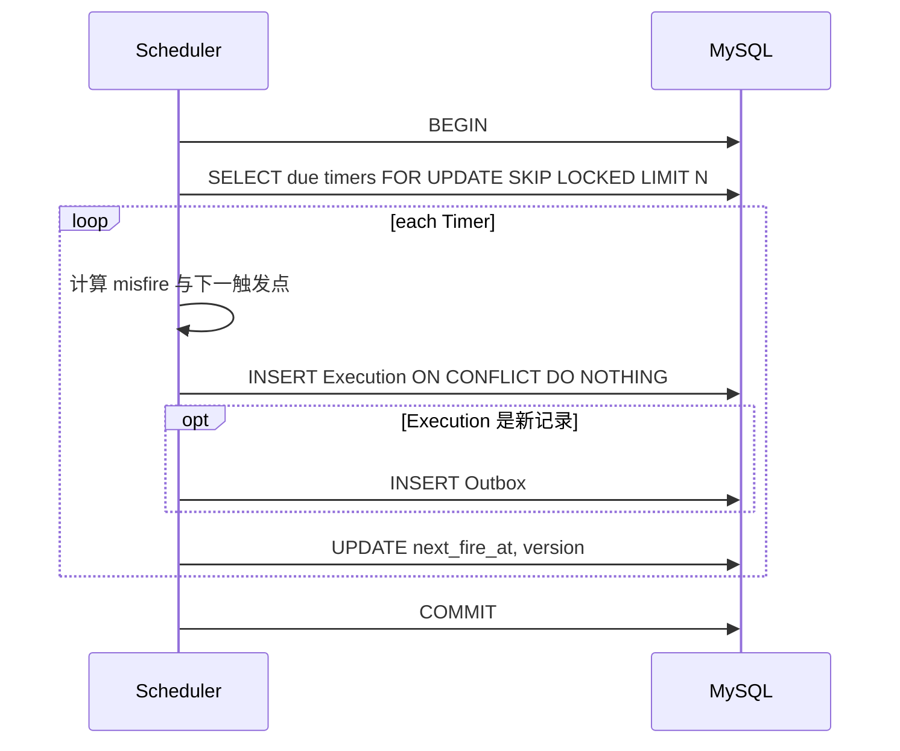

# Scheduler 设计

## 1. 输入与输出

Scheduler 的输入是 MySQL 中到期的 Timer：

```sql
status = 'ACTIVE'
AND next_fire_at IS NOT NULL
AND next_fire_at <= UTC_TIMESTAMP(3)
```

输出是：

1. 零到多条 `timer_executions`；
2. 与新 Execution 一一对应的 `outbox_events`；
3. Timer 更新后的 `next_fire_at` 和 `version`。

三类写入必须在同一个事务中完成。

## 2. 单批调度



仓库层拥有事务，服务层只负责 Cron 和 misfire 计算。事务期间不调用 Redis 或 HTTP，以免持锁时间受外部系统影响。

## 3. 多副本调度

`FOR UPDATE SKIP LOCKED` 让每个 Scheduler 副本跳过已被其他事务领取的 Timer，从而在 MySQL 内进行工作分配。

唯一键仍然必不可少：

```sql
UNIQUE KEY uk_execution_schedule(timer_id, scheduled_at)
```

行锁是并发协调手段，唯一键是业务不变量。即使发生重试、超时或未来实现变化，同一 Timer 的同一计划时间也只能有一条 Execution。

`version` 用于条件推进游标。如果行状态意外变化，当前事务失败并重试，避免静默覆盖。

## 4. 激活、停用与删除

### 激活

API 读取 INACTIVE Timer，按其时区计算下一触发点，并执行条件更新：

```text
INACTIVE → ACTIVE
next_fire_at = cron.Next(now)
version = version + 1
```

### 停用

```text
ACTIVE → INACTIVE
next_fire_at = NULL
version = version + 1
```

### 删除

逻辑删除设置 `DELETED` 并清空 `next_fire_at`。已生成的 Execution 保留历史，不会因为 Timer 停用或删除而自动抹除。

并发激活/停用通过 `WHERE id=? AND status=?` 条件更新解决；只有一个请求可以成功改变预期状态。

## 5. Misfire 算法

设：

- `current = next_fire_at`
- `now = 当前 UTC 时间`
- `grace = misfire_grace_seconds`
- `overdue = now - current > grace`

行为：

```text
未超过 grace:
  创建 current
  next_fire_at = cron.Next(current)

SKIP:
  不创建
  next_fire_at = cron.Next(now)

FIRE_ONCE:
  创建 current
  next_fire_at = cron.Next(now)

CATCH_UP:
  从 current 开始创建 <= now 的触发点
  最多 max_catch_up 条
  next_fire_at = 第一个未创建的触发点
```

当 `CATCH_UP` 达到上限但仍有积压时，Timer 仍保持到期状态，后续批次继续补偿，不会在单个事务中无限循环。

## 6. 轮询与容量

`poll_interval_ms` 决定空闲延迟，`batch_size` 决定单事务工作量。生产调优应观察：

- Scheduler 批次耗时；
- 每批生成数；
- 到期 Timer 积压；
- MySQL 锁等待和连接池；
- Outbox 未发布数量。

增加 Scheduler 副本只改善 Timer 扫描和生成吞吐，不改善回调吞吐。回调吞吐由 Worker 副本数和每个实例的 `worker.pool_size` 决定。

## 7. 不使用 Redis 分布式锁的原因

Scheduler 的权威状态已经在 MySQL。用 Redis 锁保护 MySQL 游标会引入两个系统之间的锁有效期、网络分区和 fencing 问题，却仍然需要数据库唯一键兜底。

当前实现直接使用 MySQL 行锁：

- 锁与数据事务同生共死；
- 事务回滚自动释放；
- 不需要猜测任务生成要多久；
- 避免 Redis 锁过期后两个持有者同时写 MySQL。

Redis 在本系统中负责投递，不负责 Timer 调度所有权。
