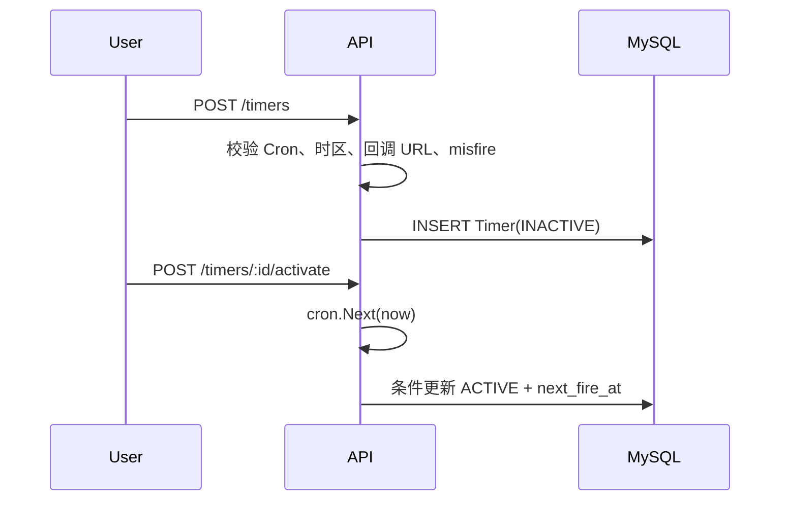
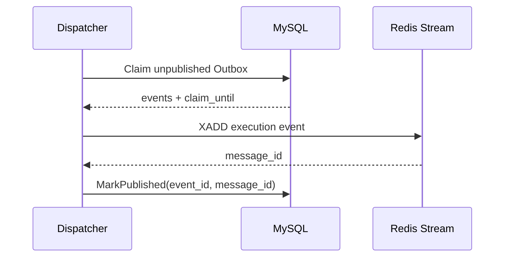
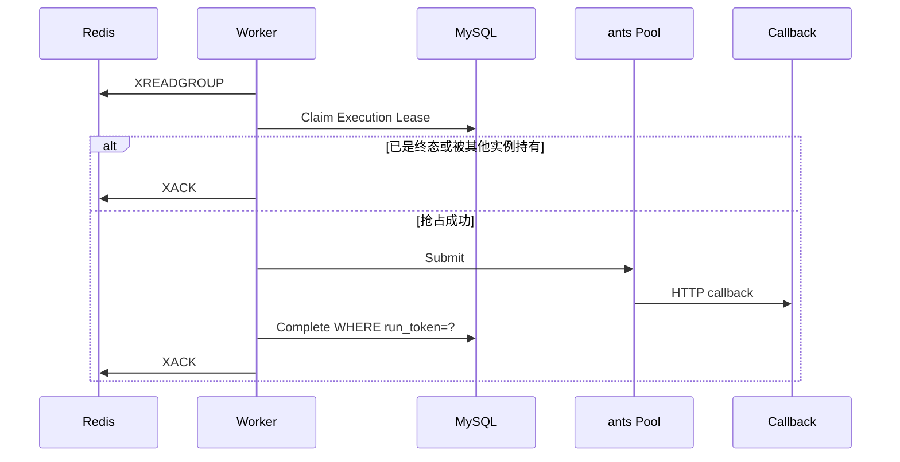

# 端到端执行流程

本文按一次 Timer 从创建到回调完成说明真实数据流。

## 1. 创建与激活



创建和激活分离，避免一条尚未确认的配置立即开始执行。

## 2. 生成 Execution

Scheduler 轮询到 `next_fire_at <= now` 的 Timer 后开启事务：

```text
锁定到期 Timer
  → 计算触发点与下一游标
  → INSERT timer_executions
  → INSERT outbox_events
  → UPDATE timer_definitions.next_fire_at
  → COMMIT
```

Execution 保存当时的回调配置快照。因此 Timer 后续状态变化不会改变已经生成的执行内容。

如果 Scheduler 在提交前崩溃，所有写入回滚；如果提交后崩溃，Outbox 已持久化，Dispatcher 会继续处理。

## 3. Outbox 投递



XADD 失败时事件留在 MySQL 并退避重试。XADD 成功但 MarkPublished 失败时，未来可能再次发布同一事件；这是至少一次投递。

## 4. Worker 领取与执行



ants 只限制当前 Worker 的并发数。Redis Consumer Group 在多个 Worker 之间分配消息。MySQL Lease 决定哪个实例有权执行和提交结果。

## 5. 结果与重试

成功的 HTTP 2xx：

```text
RUNNING → SUCCESS → XACK
```

可重试错误包括网络错误、超时、`408`、`425`、`429` 和 `5xx`：

```text
RUNNING
  → RETRY_WAIT
  → 在同一 MySQL 事务写重试 Outbox
  → available_at 到期后再次进入 Stream
  → RUNNING
```

确定性 `4xx` 直接进入 `FAILED`。达到 `max_attempts` 后不再重试。

## 6. 崩溃恢复

### Worker 在回调前崩溃

消息留在 Redis Pending，Execution Lease 到期。其他 Worker 使用 `XAUTOCLAIM` 接管。

### Worker 在回调后、保存结果前崩溃

系统会重试，外部回调可能收到重复请求。调用方必须按 Execution ID 幂等。

### Redis 丢失消息

Reconciler 扫描长时间处于 `PENDING` 且没有新投递记录的 Execution，写入恢复 Outbox。

### RUNNING Lease 过期

Reconciler 将其恢复到可执行状态或在尝试耗尽后标记失败。旧 Worker 的 `run_token` 已失效，不能提交过期结果。

### Redis 停机

Scheduler 和 API 继续使用 MySQL。Outbox 增长；Redis 恢复后 Dispatcher 补投。Dispatcher/Worker 的 `/ready` 在故障期间返回非就绪。

## 7. 一次执行的可观测轨迹

排障时按以下顺序检查：

1. `timer_definitions.next_fire_at` 是否推进；
2. 对应 `(timer_id, scheduled_at)` 的 Execution 是否存在；
3. Outbox 是否已发布、是否有错误和下一重试时间；
4. Redis Consumer Group 是否有 Pending；
5. Execution 的 `lease_owner`、`lease_until`、`attempt` 和状态；
6. Worker 指标、回调状态码和截断后的错误信息。

MySQL 中的 Execution ID 是整条链路最稳定的关联键。
