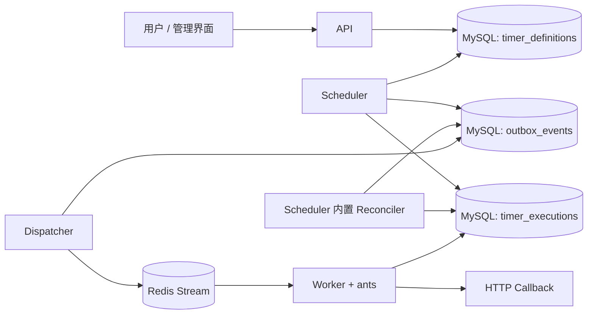
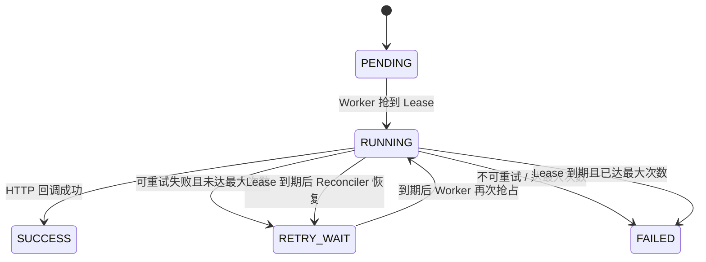

# ChronoFlow 角色与运行机制

本文描述当前开发阶段中四个常驻角色的职责、数据流、执行频率与故障恢复行为。它以当前 `config/config.yaml` 的默认值为准；通过 `CHRONOFLOW_` 环境变量或配置文件修改参数后，应以实际配置为准。

## 1. 总览

ChronoFlow 将控制、调度、可靠投递和回调执行拆成四个独立进程：



MySQL 是权威状态存储：Timer、Execution、Outbox 以及执行结果都以 MySQL 为准。Redis Streams 只负责跨进程通知和消费，不保存最终业务状态。

| 角色 | 主要依赖 | 是否操作 Cron | 是否执行回调 | 是否可多副本 | 默认端口 |
| --- | --- | --- | --- | --- | --- |
| API | MySQL | 仅创建/激活时计算下一次 | 否 | 是 | 8080 |
| Scheduler | MySQL | 是 | 否 | 是 | 8081 |
| Dispatcher | MySQL、Redis | 否 | 否 | 是 | 8082 |
| Worker | MySQL、Redis、目标 HTTP 服务 | 否 | 是 | 是 | 8083 |

同一台机器同时启动四个角色时，端口必须不同。当前 Makefile 已设置默认端口：

```bash
make dev-api
make dev-scheduler
make dev-dispatcher
make dev-worker
```

四个进程收到 `SIGINT` 或 `SIGTERM` 后会停止接收新工作，并在最多 15 秒（`runtime.shutdown_timeout_seconds`）内完成 HTTP 服务关闭与后台任务收尾。

## 2. 关键状态与一次完整执行

### 2.1 Timer、Execution 与 Outbox

- `timer_definitions`：定时器定义。`next_fire_at` 是下一次应被调度的触发点，保存为当前时间。
- `timer_executions`：某个 Timer 在某个 `scheduled_at` 触发点的一次执行。唯一键 `(timer_id, scheduled_at)` 阻止同一触发点重复生成。
- `outbox_events`：需可靠投递给 Redis 的事件。它与 Execution 的状态变更处于同一个 MySQL 事务中，避免 MySQL 成功但 Redis 投递丢失的双写问题。

一次正常的执行路径如下：

1. API 创建 Timer，初始状态为 `INACTIVE`。
2. API 激活 Timer，按 Cron 表达式计算第一个 `next_fire_at`。
3. Scheduler 领取到期 Timer，并在一个 MySQL 事务中：创建 `PENDING` Execution、创建 `EXECUTION_READY` Outbox、推进 Timer 的 `next_fire_at`。
4. Dispatcher 领取尚未发布的 Outbox，通过 `XADD` 写入 Redis Stream，然后回写 `published_at`。
5. Worker 以 Consumer Group 读取 Stream 消息，先在 MySQL 抢占 Execution 的 Lease，再发起 HTTP 回调。
6. Worker 将最终结果写回 Execution：成功为 `SUCCESS`；可重试失败为 `RETRY_WAIT` 并创建新的 Outbox；不可重试或达到上限为 `FAILED`。
7. Worker 在 MySQL 结果成功落库后才对 Stream 消息执行 `XACK`。

因此，Redis 消息可能重复，但同一条 Execution 在同一时刻只能被持有有效 MySQL Lease 的 Worker 实际处理。

### 2.2 Execution 状态



默认 `max_attempts` 为 3，`attempt` 在每次成功抢占 Lease 时加 1。`CANCELLED` 是终态，目前用于保留扩展的取消语义。

## 3. API：控制面

### 3.1 职责

API 只提供管理和查询能力，不扫描到期 Timer、不发布 Redis 消息、也不调用业务回调。它负责：

- 创建、查询、删除、激活、停用 Timer；
- 查询 Execution 和监控摘要；
- 提供管理前端静态资源与 Grafana 反向代理；
- 提供 `/health`、`/ready`、`/metrics`。

Timer 创建时会校验六字段 Cron、回调 URL 和 misfire 策略。创建后的 Timer 为 `INACTIVE`；只有调用激活接口后才会写入权威的 `next_fire_at`，进入 Scheduler 的扫描范围。

### 3.2 运行方式与频率

API 没有自身的定时轮询任务，完全按 HTTP 请求触发工作。

| 项目 | 当前默认值 | 说明 |
| --- | ---: | --- |
| HTTP 端口 | 8080 | `make dev-api` 显式设置 |
| 请求头读取超时 | 5 秒 | 防止慢请求头占用连接 |
| `/ready` 依赖检查超时 | 2 秒 | API 检查 MySQL 连通性 |
| 优雅关闭上限 | 15 秒 | `runtime.shutdown_timeout_seconds` |

如果配置了 `security.api_key`，所有 `/api/*` 请求须携带 `X-API-Key` 或 `Authorization: Bearer <key>`。`/health`、`/ready`、`/metrics` 不承担 Timer 管理职责。

## 4. Scheduler：权威调度与恢复

### 4.1 Scheduler 主循环

Scheduler 只依赖 MySQL，不依赖 Redis。启动后会立即执行一次调度，随后以固定间隔扫描：

| 配置 | 默认值 | 实际行为 |
| --- | ---: | --- |
| `scheduler.poll_interval_ms` | 500 毫秒 | 启动立即扫描一次，之后每 500 毫秒扫描一次 |
| `scheduler.batch_size` | 100 | 单个 MySQL 事务最多领取 100 个到期 Timer |
| `scheduler.misfire_grace_seconds` | 5 秒 | 晚于计划时间超过 5 秒视为 misfire |
| `scheduler.default_max_catch_up` | 10 | 创建 Timer 时未传 `max_catch_up` 的默认补偿上限；也用于历史或异常数据中该值无效时的兜底 |

扫描条件为：`status = ACTIVE AND next_fire_at <= 当前时间`。领取查询使用 `SELECT ... FOR UPDATE SKIP LOCKED`，因此可以启动多个 Scheduler：同一个 Timer 行被一个实例锁定时，其他实例会跳过它，而不是阻塞或重复调度。

每个被领取的 Timer 在**同一个 MySQL 事务**内完成：

1. 根据 Cron 和 misfire 策略计算本轮应产生的触发点及新的 `next_fire_at`；
2. 每个触发点插入一条 `PENDING` Execution；
3. 为每条新 Execution 插入一条 `EXECUTION_READY` Outbox；
4. 乐观锁更新 Timer 的 `next_fire_at` 与 `version`；
5. 提交事务。

若两个 Scheduler 因故障恢复等原因都尝试为同一触发点建记录，`(timer_id, scheduled_at)` 唯一键会将后一次插入变为无效，不会产生两条 Execution。

### 4.2 Misfire 策略

当 `now - next_fire_at > 5 秒`（默认宽限期）时，Timer 被视为错过触发点：

| 策略 | 行为 |
| --- | --- |
| `SKIP` | 不创建遗漏 Execution，直接计算未来的下一个触发点。 |
| `FIRE_ONCE`（默认） | 只补发当前遗漏触发点一次，然后跳到未来的下一个触发点。 |
| `CATCH_UP` | 按历史顺序补发多个遗漏触发点，最多 `max_catch_up` 个；默认上限 10。 |

正常情况下，`FIRE_ONCE` 和 `SKIP` 之外的行为不会因为 500 毫秒轮询本身而额外创建任务；Timer 被处理后会立即推进 `next_fire_at`。

### 4.3 Scheduler 内置 Reconciler

Scheduler 进程还运行一个 Reconciler，它不是 Cron 调度器，而是 MySQL 中断恢复与历史清理器。

| 配置 | 默认值 | 行为 |
| --- | ---: | --- |
| `recovery.enabled` | `true` | 是否启用恢复与清理 |
| `recovery.scan_interval_seconds` | 10 秒 | 启动立即扫描一次，之后每 10 秒恢复一次 |
| `recovery.pending_stale_seconds` | 30 秒 | `PENDING` / `RETRY_WAIT` 超过该时长未重新入队时，可创建恢复 Outbox |
| `recovery.batch_size` | 100 | 每次恢复或清理最多处理 100 条 |
| `recovery.cleanup_interval_minutes` | 60 分钟 | 每小时清理一次历史数据；首次不会立即清理 |
| `recovery.outbox_retention_days` | 7 天 | 清理已发布且过期的 Outbox |
| `recovery.execution_retention_days` | 30 天 | 清理已结束且不再关联 Outbox 的 Execution |

Reconciler 处理三类情况：

- 已到期但长时间未入队的 `PENDING` Execution；
- 已到重试时间但长时间未入队的 `RETRY_WAIT` Execution；
- Lease 已过期的 `RUNNING` Execution：未达到最大尝试次数则重置为 `RETRY_WAIT` 并重新创建 Outbox；达到上限则标记 `FAILED`。

所以即使 Dispatcher 或 Redis 曾不可用，Scheduler 已写入 MySQL 的 Execution/Outbox 仍可以在系统恢复后继续流转。

## 5. Dispatcher：MySQL Outbox 到 Redis Streams

### 5.1 职责与启动

Dispatcher 负责把已经提交的 Outbox 事件发布到 Redis Stream `chronoflow:execution:ready`。它在启动时会在最多 5 秒内确保 Consumer Group `chronoflow-workers` 已创建；之后开始轮询 MySQL。

| 配置 | 默认值 | 实际行为 |
| --- | ---: | --- |
| `outbox.poll_interval_ms` | 200 毫秒 | 启动立即执行一次，之后每 200 毫秒领取 Outbox |
| `outbox.batch_size` | 100 | 每轮最多领取 100 条可发布事件 |
| `outbox.claim_ttl_seconds` | 30 秒 | 一个 Dispatcher 领取事件后的所有权期限 |
| `outbox.max_backoff_seconds` | 30 秒 | Redis 发布失败的退避上限 |
| `outbox.stream_max_len` | 0 | 不按长度截断 Stream；由 Worker 的安全清理器处理历史 |

多个 Dispatcher 可同时运行。领取 Outbox 时同样采用 MySQL 行锁与 `SKIP LOCKED`，并写入 `claim_owner`、`claim_until`。其他实例不会领取仍处于有效 Claim 的事件；持有者崩溃后最多约 30 秒，事件即可被其他实例重新领取。

### 5.2 发布、确认与重试

对每条已领取 Outbox，Dispatcher 按下列顺序处理：

1. 调用 Redis `XADD` 将 `event_id`、`execution_id` 等载荷写入 Stream；
2. 成功后在 MySQL 中更新 `published_at`、Redis 消息 ID，并清除 Claim；
3. Redis 写入失败时记录错误、增加尝试次数、清除 Claim，并设置 `next_attempt_at`；
4. 下次轮询到达 `next_attempt_at` 后重新领取。

发布退避是指数退避：1、2、4、8、16、30、30… 秒（上限由 `outbox.max_backoff_seconds` 决定）。

若 Redis `XADD` 已成功，但 Dispatcher 在写回 MySQL 前崩溃，Outbox 仍会在 Claim 过期后再次发布。这是预期的“至少一次”语义；消息可能重复，最终由 Worker 的 MySQL Execution Claim 去重。

## 6. Worker：消费、回调与重试

### 6.1 消费模型

Worker 以 Redis Consumer Group 消费 `chronoflow:execution:ready`。每个 Worker 进程使用由“角色、主机名、PID”组成的唯一消费者名称。它不相信 Redis 消息本身的唯一性：收到消息后，必须先在 MySQL 原子抢占对应 Execution 的 Lease。

抢占成功时，Execution 会变为 `RUNNING`，写入：

- `lease_owner`：当前 Worker 实例；
- `lease_until`：Lease 到期时间；
- `run_token`：随机的单次执行令牌；
- `attempt`：尝试次数加一。

后续的续租、成功写回与失败写回都同时匹配 `execution_id + lease_owner + run_token`。这会阻止已失去 Lease 的旧 Worker 覆盖新 Worker 的执行结果。

### 6.2 默认执行频率和并发

| 配置 | 默认值 | 实际行为 |
| --- | ---: | --- |
| `worker.read_count` | 20 | 每次从 Stream 最多读取 20 条新消息 |
| `worker.read_block_ms` | 2000 毫秒 | 没有新消息时，`XREADGROUP` 最多阻塞 2 秒 |
| `worker.pool_size` | 100 | 单个 Worker 进程最多 100 个 ants 并发回调任务 |
| `worker.lease_ttl_seconds` | 30 秒 | 抢占 Execution 后的初始 Lease 有效期 |
| `worker.heartbeat_seconds` | 10 秒 | 回调尚未完成时每 10 秒续租一次 |
| `worker.http_timeout_seconds` | 12 秒 | 单次 HTTP 回调超时 |
| `worker.reclaim_idle_seconds` | 30 秒 | Pending 消息闲置至少 30 秒后可被接管 |
| `worker.reclaim_interval_seconds` | 10 秒 | 启动立即检查一次，之后每 10 秒接管一次 Pending 消息 |

Worker 每次读取到消息即提交给 ants 池；池满时，提交会等待可用 worker，而不会无限创建 goroutine。Pool 的并发上限是**单个 Worker 进程**的限制，增加 Worker 副本会线性提高全局理论并发能力，但仍受目标 HTTP 服务、MySQL 和 Redis 容量约束。

如果收到损坏消息或缺少 `execution_id`，Worker 会记录错误并 `XACK`，避免该消息永久阻塞 Consumer Group。

### 6.3 回调结果与重试

Worker 调用 Execution 中保存的请求快照，而不是读取当前 Timer 回调配置；因此后续修改 Timer 不会改变已经生成的 Execution。

以下情形被视为可重试：网络/超时错误、HTTP `408`、`425`、`429` 以及所有 `5xx` 响应。其他 HTTP `4xx` 是不可重试失败。

默认重试间隔为 2、4、8、16、32、60、60… 秒（`retry_base_seconds=2`，`retry_max_seconds=60`）。发生可重试失败时，Worker 在一个 MySQL 事务中将 Execution 更新为 `RETRY_WAIT`，并创建 `EXECUTION_RETRY` Outbox；随后才 `XACK` 当前 Stream 消息。Dispatcher 将这个新 Outbox 再投递给 Stream。

成功或终态失败都要求 MySQL 状态更新成功后才 `XACK`。如果状态更新失败，消息保持 Pending，后续会被接管或由 Reconciler 恢复。

### 6.4 Pending 接管与 Stream 清理

当 Worker 崩溃、连接中断或未能 `XACK` 时，消息会停留在 Consumer Group 的 Pending 列表中。任意 Worker 每 10 秒调用一次自动接管：消息空闲至少 30 秒后可由新的消费者处理。即使 Redis 层重复交付，MySQL Lease 仍是最后的执行所有权判断。

Worker 内置 Stream 清理器：

| 配置 | 默认值 | 行为 |
| --- | ---: | --- |
| `recovery.cleanup_interval_minutes` | 60 分钟 | 每小时尝试清理一次；启动时不立即清理 |
| `recovery.stream_retention_hours` | 24 小时 | 仅移除超过 24 小时且已确认的 Stream 历史 |

清理器会保留最早的 Pending 消息及之后的所有消息，因此不会为了缩短 Stream 而删除尚未确认的工作。

## 7. 时间语义与部署约束

当前项目以当前时间读写 MySQL `DATETIME` 字段，程序不会强制转换为 UTC。

## 8. 监控与排障入口

每个角色都有独立 HTTP 端口，均提供：

- `GET /health`：进程存活、角色、组件和当前时间；
- `GET /ready`：依赖就绪检查，检查超时 2 秒；
- `GET /metrics`：Prometheus 指标。

API 还提供 Timer、Execution 和监控查询接口。排障时优先以 MySQL 为准：检查 `timer_definitions.next_fire_at`、`timer_executions.status/lease_until/next_attempt_at`、`outbox_events.published_at/next_attempt_at/claim_until`，再检查 Redis Consumer Group Pending 数量。

常见判断：

| 现象 | 优先检查 |
| --- | --- |
| 到点却没有 Execution | Scheduler 是否运行；`next_fire_at`、Timer 状态、Scheduler 日志与 MySQL 锁等待 |
| 有 Execution 但没有 Stream 消息 | `outbox_events` 是否未发布；Dispatcher 是否运行；Redis 连通性 |
| 消息积压或重复 | Worker 数量、ants `pool_size`、Pending 数、Execution Lease 与回调服务响应 |
| 回调不断重试 | `response_code`、`error_message`、`attempt/max_attempts`、目标服务状态 |
| 任务在故障后未恢复 | Scheduler 内 Reconciler 是否启用；`last_enqueued_at`、`lease_until` 与 Recovery 日志 |
